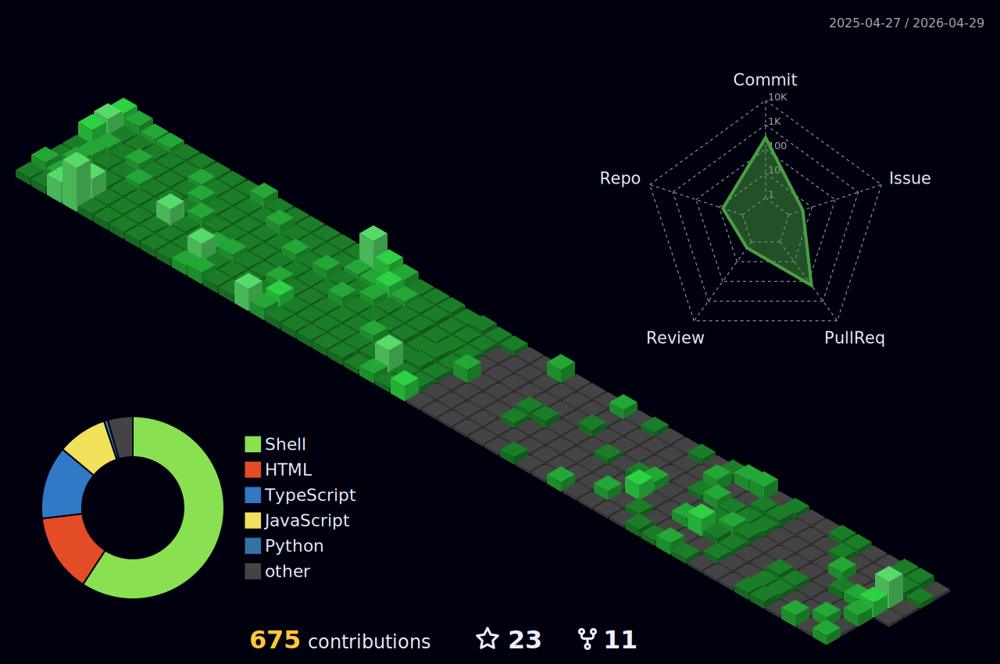

# 🟢 ALEX.SYS v2.0.25 - READY FOR CONNECTION
```
████████╗███████╗██████╗ ███╗   ███╗██╗███╗   ██╗ █████╗ ██╗     
╚══██╔══╝██╔════╝██╔══██╗████╗ ████║██║████╗  ██║██╔══██╗██║     
   ██║   █████╗  ██████╔╝██╔████╔██║██║██╔██╗ ██║███████║██║     
   ██║   ██╔══╝  ██╔══██╗██║╚██╔╝██║██║██║╚██╗██║██╔══██║██║     
   ██║   ███████╗██║  ██║██║ ╚═╝ ██║██║██║ ╚████║██║  ██║███████╗
   ╚═╝   ╚══════╝╚═╝  ╚═╝╚═╝     ╚═╝╚═╝╚═╝  ╚═══╝╚═╝  ╚═╝╚══════╝
```

<div align="center">

### 🔌 ESTABLISHING CONNECTION TO ALEX_CS_SALINAS...
</div>

---

<table width="100%">
<tr>
<td width="50%">

```bash
$ whoami
alex_salinas@umich:~$ cat profile.txt
```

<div style="background: #0d1117; padding: 15px; border-radius: 6px; font-family: 'Courier New', monospace; border: 1px solid #30363d;">

**USER:** Alexander Salinas  
**EDU:** Computer Science @ University of Michigan  
**LOC:** Building cool things everywhere  
**STATUS:** <span style="color: #7c3aed;">⚡ Currently creating</span>  
**MOTTO:** "I like building!"  

</div>

</td>
<td width="50%">

```bash
$ ls -la skills/
```

<details>
<summary>📁 <code>/languages/</code> <kbd>CLICK TO EXPLORE</kbd></summary>

```cpp
class Skills {
private:
    vector<string> languages = {
        "C++",        // ⚡ Primary
        "Python",     // 🐍 Versatile  
        "Java",       // ☕ Robust
        "JavaScript", // 🌐 Dynamic
        "HTML/CSS"    // 🎨 Frontend
    };
public:
    void displaySkills() {
        cout << "Ready to build anything!" << endl;
    }
};
```
</details>

</td>
</tr>
</table>

---

<div align="center">

## 🖥️ ACTIVE_PROCESSES.EXE

</div>

<table width="100%" style="border: 2px solid #7c3aed; border-radius: 10px;">
<tr style="background: linear-gradient(90deg, #1a1a2e, #16213e);">
<th align="center">PROJECT</th>
<th align="center">STATUS</th>
<th align="center">ACCESS</th>
</tr>
<tr>
<td align="center">
<strong>🏢 MBooking Platform</strong><br>
<small><em>Booking system magic</em></small>
</td>
<td align="center">
<span style="color: #22c55e;">LIVE</span>
</td>
<td align="center">
<a href="https://mbooking.me">

</a>
</td>
</tr>
<tr>
<td align="center">
<strong>🔌 VS Code Extension</strong><br>
<small><em>Terminal Tracker</em></small>
</td>
<td align="center">
<span style="color: #3b82f6;">PUBLISHED</span>
</td>
<td align="center">
<a href="https://marketplace.visualstudio.com/items?itemName=AlexanderSalinas.terminal-tracker">

</a>
</td>
</tr>
<tr>
<td align="center">
<strong>🌐 Portfolio Website</strong><br>
<small><em>Digital presence</em></small>
</td>
<td align="center">
<span style="color: #22c55e;">ONLINE</span>
</td>
<td align="center">
<a href="https://alexcsalinas.com">

</a>
</td>
</tr>
</table>

---

<details>
<summary>🎮 <strong>RUN INTERACTIVE_MODE.EXE</strong></summary>

```bash
$ ./social_network_scanner.sh
```

<div style="background: #0d1117; padding: 20px; border-radius: 6px; border: 1px solid #7c3aed;">

```
Scanning for social connections...
[████████████████████████] 100%

CONNECTIONS FOUND:
┌──────────────────────────────────────┐
│  Email    → alexsali@umich.edu       │
│  LinkedIn → alexandercsalinas        │  
│  Web      → alexcsalinas.com         │
│  GitHub   → You're already here!     │
└──────────────────────────────────────┘
```

</div>

</details>

---

<div align="center">

### 📈 CONTRIBUTION_MATRIX.SYS



```
Loading visual representation...
[▓▓▓▓▓▓▓▓▓▓▓▓▓▓▓▓▓▓▓▓] COMPLETE
Green squares = commits = happiness
```

</div>

---

<div align="center" style="background: linear-gradient(45deg, #1a1a2e, #16213e); padding: 20px; border-radius: 10px; margin: 20px 0;">

### BOOT_SEQUENCE_COMPLETE

```bash
$ echo "Thanks for visiting my digital workspace!"
Thanks for visiting my digital workspace!

$ fortune | cowsay
 _________________________________
< Let's build something amazing! 🚀 >
 ---------------------------------
        \   ^__^
         \  (oo)\_______
            (__)\       )\/\
                ||----w |
                ||     ||
```

**SYSTEM:** Ready for new connections and collaborations  
**UPTIME:** Constantly learning and building  
**NEXT:** What should we create together?

</div>

---

<div align="center">
<sub>Crafted with terminal love and markdown magic • Always building • Never stopping</sub>
</div>
